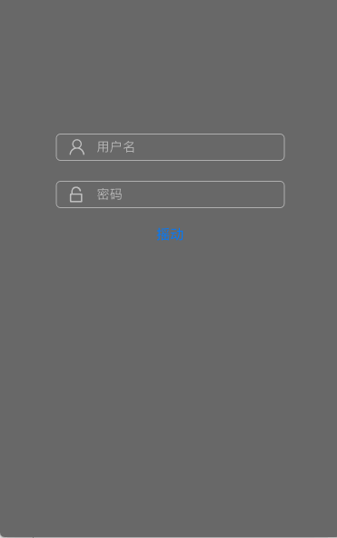

# Utils
一些工作中常用的工具类

## Launch
* 自动设置应用启动标志，提供判断应用是否为第一次启动的方法
* 使用版本号作为判断依据，安装新版本后启动应用则认为是首次启动
* 常用于控制显示新手引导等需要根据首次启动和非首次启动执行不同逻辑的模块

## Album
* 相册 图片、视频 文件操作类
* 提供获取、保存、删除操作方法

## LoginTextField

* 登录页面`用户名` `密码`输入框
* 提供了常用的样式实现
* 支持自定义样式
* 支持 `点击屏幕`、`return键` 收键盘
* 提供`shake动画`，当输入错误时调用shake方法提示用户

## Img Title Vertical Button

* `img在上`、`title在下` 样式的按钮

## NavigationBar
* 提供自定义导航条样式的一些常用操作
* 包括：设置背景图；设置左/右侧按钮图片、文本、系统按钮、触发的action

## TabBar
* 提供自定义tabbar样式的一些常用操作
* 包括：设置背景图、背景色；设置BarItem标题选中和未选中的颜色；设置BarItem选中和未选中的图片

## MBProgressHUDUtil
* 在[MBProgressHUD](https://github.com/jdg/MBProgressHUD)基础上添加了一般使用场景中更简洁的API
* 包括：展示自动消失的提示、执行方法期间显示loading提示、可以提供自定义的view作为loading提示

## FileUtil
* 提供常用的沙盒路径和存储操作
* 包括：获取Documents路径、创建目录或文件、检测目录或文件是否存在、获取目录下所有文件、清空目录

## Reflection
* 反射
* String扩展类，提供String->AnyClass、String->AnyObject转换

## Video
* 视频操作类
* 包括：获取视频第一帧截图

## DeviceID
* 使用KeychainWrapper存取设备ID
* 包括：获取设备ID，当钥匙串中不存在时会自动创建一个存到钥匙串并返回

## Encrypt
* 常用的加密算法
* 包括：DES、Base64、MD5

## Extensions
* 其它一些扩展类
* **UIColor+Extension**：将颜色转换为图片、获取颜色rgba值、设置alpha值
* **UIView+Extension**：设置圆角、设置阴影、设置边框、将view转化为图片、获取view的上一级ViewController、获取view的上一级NavigationController
* **NSString+Category**：string->date转换、在特定字体下单行显示该字符串所需要的宽度、在特定字体特定宽度下多行显示该字符串所需要的高度
* **NSDate+Category**：date->string转换、获取当前时间
